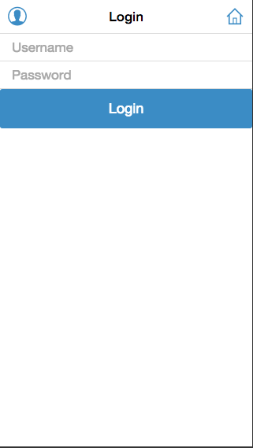

# An app demo build with Gulp, React, Ratchet.

+ Build

	+ Execute **init.sh** to install core gulp plugins。
	+ Execute **gulp** command to build all source。
	+ Open **public/views/login.html** or **register.html** in Chrome's device mode:

	 